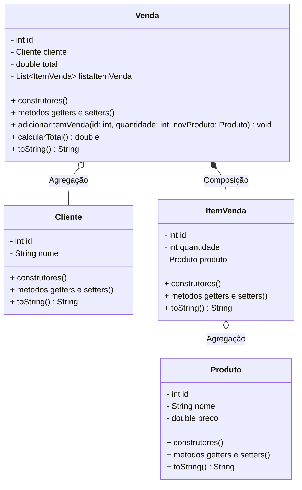

```mermaid
classDiagram
    class Cliente {
        - int id
        - String nome
        + construtores()
        + metodos getters e setters()
        + toString() String
    }

    class Produto {
        - int id
        - String nome
        - double preco
        + construtores()
        + metodos getters e setters()
        + toString() String
    }

    class ItemVenda {
        - int id
        - int quantidade
        - Produto produto
        + construtores()
        + metodos getters e setters()
        + toString() String
    }

    class Venda {
        - int id
        - Cliente cliente
        - double total
        - List~ItemVenda~ listaItemVenda
        + construtores()
        + metodos getters e setters()
        + adicionarItemVenda(id: int, quantidade: int, novProduto: Produto) void
        + calcularTotal() double
        + toString() String
    }

    Venda o-- Cliente : Agregação
    Venda *-- ItemVenda : Composição
    ItemVenda o-- Produto : Agregação
```