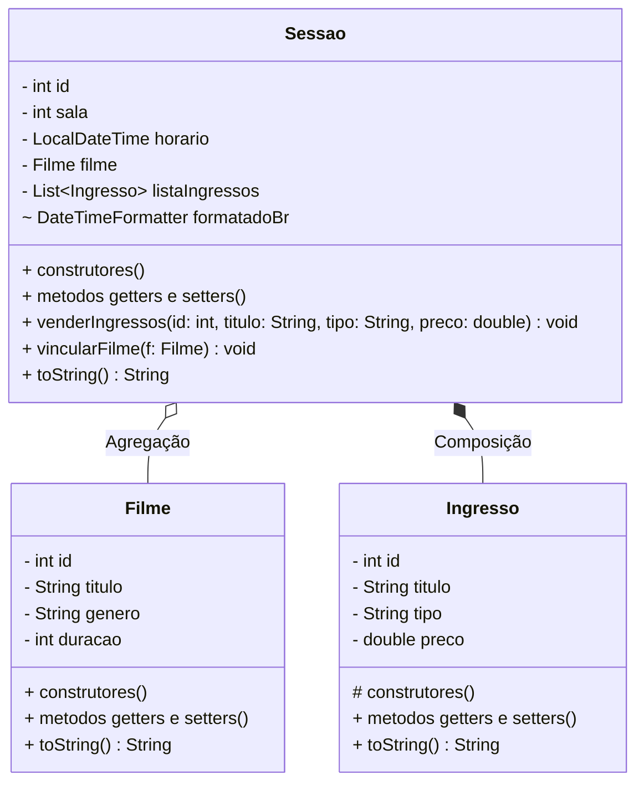

```mermaid
classDiagram
    class Filme {
        - int id
        - String titulo
        - String genero
        - int duracao
        + construtores()
        + metodos getters e setters()
        + toString() String
    }

    class Ingresso {
        - int id
        - String titulo
        - String tipo
        - double preco
        # construtores()
        + metodos getters e setters()
        + toString() String
    }

    class Sessao {
        - int id
        - int sala
        - LocalDateTime horario
        - Filme filme
        - List~Ingresso~ listaIngressos
        ~ DateTimeFormatter formatadoBr
        + construtores()
        + metodos getters e setters()
        + venderIngressos(id: int, titulo: String, tipo: String, preco: double) void
        + vincularFilme(f: Filme) void
        + toString() String
    }

    Sessao o-- Filme : Agregação
    Sessao *-- Ingresso : Composição
```